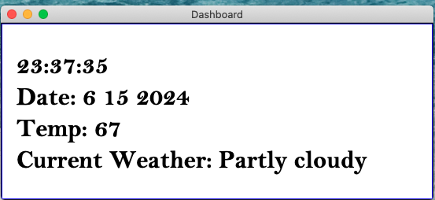

## Code in Place
## Ron Lee
## _Time/Date and Weather Dashboard_

Git Hub URL:
https://github.com/ronwlee/cip_dashboard/tree/master

This project produces a simple graphical dashboard in a window on the desktop. 

Code development uses VS Code on a Macbook.
Extended python libraries used:
 - Json
 - requests
 - tkinter
 - datetime
 - time
 - 
 
Screenshot of current version:

# Structure of Code
main file: dashboard_v1.py

## Main challenges
There were three main challenges:
1) use of VScode on a Mac
2) collecting weather data from web site
3) user of Tkinter for graphics 

The first challenge was use of VScode on a Macbook. This was necessary because I needed to add additioal Python libraries and the Code in Place IDE does not support installing and importing additional libraries

Collection of weather data was an interesting challenge. A search in Google turned up several sites with API to get weather data. I found a site called "wttr.in" that return weather in text format and also provided JSON output. Here is a screenshot of the output from wttr.in:

I was able to use the JSON output from wttr.in and it returned a JSON structure that looks like:

Using the JSON libary I was able to import the JSON structure into a dictionary and quickly reference each element. The JSON view I used was very helpful in browsing and finding the data I was looking for. 

Since I was not using the Code in Place IDE I had to find a graphics libary. A recomendation from the Project forum pointed me to Tkinter. After reading several tutorials I was able to put together the dashboard.

## Comments on code structure

This section provides an overiew of the major code blocks with high level comments on how things were handled. 

get_weather function:
This function makes a call to wttr.in and parses the JSON into a dictionary called weather which is returned to the caller.

dtime, ddate and dcondition functions:
These functions return the strings that are displayed by the labels. They handle getting the data and formatting it for the Tkinter Label. One display aspect that need to be taken care of is the leading zero in minutes and seconds. To keep the spacing consistent I insert a 0 when the minute or seconds is less than 10.

Building the window:
In this section we create the root window and position the labels in the window. This code handles all the visual aspects of the labels.

Main loop:
I could not use the mainloop() call used by Tkinter as I have proram logic that needs to run. The program logic updates the time, refreshed the weather info, etc.

The main look runs with a sleep(1) call so the loop completes an update every second. This is determied by the time/data function. One item to note is the update of the weather info. Many of the weather apis cahrge by the API call and weather is a slow changing data source. My code updates the weather on the 0,15,30 and 45 minutes of teh house. 

# Future development
This version is my minimum function prototype. I will continue develop and look at features such as:
- representing the weather with icons
- implementing out information sources, using the same structure as collecting of weather I think I can add things like news headines, etc.
- porting to dedicated hardware - I would like to make this into an appliance and run on a platform like a Raspberry Pi with a LCD display. 
- rendering as a web page - I would like to explore being able to render the display as a web page, this would allow me to display on tablems, spare phones, TVs, etc. I would like to render this to a Amazon Kindle e-innk display!

# Toolkit
This project was also a big learning effort for new tooks. Some of the tools I used were:
- Microsoft VScode IDE
- JSON Viewer https://jsonformatter.org/json-viewer
- wttr.in git hub repo and docs https://github.com/chubin/wttr.in#different-output-formats
- Tkinter graphics libraries
- GIThub source code repository

